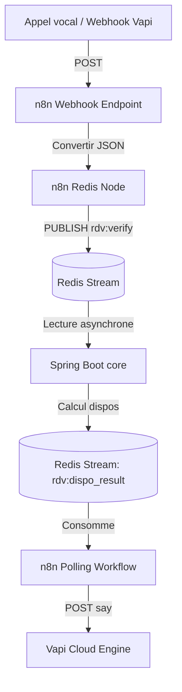

# Guide Métier et Files d'attente : Phases 3 et 4

Ce guide décrit l'implémentation de la logique métier (calcul des créneaux libres, synchronisation de calendrier, WebSockets) et de la communication asynchrone via Redis Streams avec n8n.

---

## Phase 3 — Core métier Spring Boot

### 1. Calcul des créneaux de disponibilité libres
La méthode centrale vérifie les plages de l'entreprise et soustrait les créneaux déjà réservés (en base locale + dans Google Calendar).

```java
package com.rdvmindset.service;

import com.rdvmindset.entity.Disponibilite;
import com.rdvmindset.repository.DisponibiliteRepository;
import com.rdvmindset.repository.RendezVousRepository;
import lombok.RequiredArgsConstructor;
import org.springframework.stereotype.Service;
import java.time.*;
import java.util.ArrayList;
import java.util.List;
import java.util.UUID;
import java.util.stream.Collectors;

@Service
@RequiredArgsConstructor
public class RdvService {
    private final DisponibiliteRepository dispoRepo;
    private final RendezVousRepository rdvRepo;
    private final CalendarService calendarService;

    public List<LocalDateTime> verifierDisponibilites(UUID entrepriseId, LocalDate date) {
        // 1. Charger les plages horaires de base définies par l'entreprise pour ce jour de la semaine
        DayOfWeek jour = date.getDayOfWeek();
        List<Disponibilite> plagesBase = dispoRepo.findByEntrepriseIdAndJourSemaine(entrepriseId, jour.getValue());

        // 2. Récupérer la durée par défaut du rendez-vous (ex: 30 minutes)
        int dureeMinutes = 30; // Idéalement chargé dynamiquement depuis AgentConfig

        // 3. Découper les plages de base en créneaux individuels (TimeSlots)
        List<LocalDateTime> creneauxTheoriques = new ArrayList<>();
        for (Disponibilite dispo : plagesBase) {
            LocalDateTime debut = LocalDateTime.of(date, dispo.getHeureDebut());
            LocalDateTime fin = LocalDateTime.of(date, dispo.getHeureFin());
            while (debut.plusMinutes(dureeMinutes).isBefore(fin) || debut.plusMinutes(dureeMinutes).isEqual(fin)) {
                creneauxTheoriques.add(debut);
                debut = debut.plusMinutes(dureeMinutes);
            }
        }

        // 4. Charger les rendez-vous existants en base locale pour ce jour
        LocalDateTime debutJour = date.atStartOfDay();
        LocalDateTime finJour = date.atTime(LocalTime.MAX);
        List<LocalDateTime> rdvLocauxPris = rdvRepo
                .findByEntrepriseIdAndDateHeureBetween(entrepriseId, debutJour, finJour)
                .stream()
                .map(rdv -> rdv.getDateHeure())
                .collect(Collectors.toList());

        // 5. Charger les événements bloqués depuis Google Calendar API (via FreeBusy API)
        List<LocalDateTime> rdvExternesPris = calendarService.getSlotsLibresDepuisGoogle(entrepriseId, date);

        // 6. Filtrer les créneaux libres
        return creneauxTheoriques.stream()
                .filter(slot -> !rdvLocauxPris.contains(slot))
                .filter(slot -> !rdvExternesPris.contains(slot))
                .collect(Collectors.toList());
    }
}
```

### 2. Configuration WebSockets STOMP (`WebSocketConfig.java`)
Permet de pousser les nouveaux rendez-vous créés directement sur le tableau de bord de l'entreprise sans rafraîchir la page.

```java
package com.rdvmindset.config;

import org.springframework.context.annotation.Configuration;
import org.springframework.messaging.simp.config.MessageBrokerRegistry;
import org.springframework.web.socket.config.annotation.EnableWebSocketMessageBroker;
import org.springframework.web.socket.config.annotation.StompEndpointRegistry;
import org.springframework.web.socket.config.annotation.WebSocketMessageBrokerConfigurer;

@Configuration
@EnableWebSocketMessageBroker
public class WebSocketConfig implements WebSocketMessageBrokerConfigurer {

    @Override
    public void configureMessageBroker(MessageBrokerRegistry config) {
        config.enableSimpleBroker("/topic"); // Destinations d'écoute (Outbound)
        config.setApplicationDestinationPrefixes("/app"); // Préfixe d'envoi (Inbound)
    }

    @Override
    public void registerStompEndpoints(StompEndpointRegistry registry) {
        registry.addEndpoint("/ws-rdv")
                .setAllowedOriginPatterns("*")
                .withSockJS(); // Fallback en HTTP long-polling si WS non dispo
    }
}
```

### 3. Pousser les évènements WebSocket (`NotificationService.java`)
```java
@Service
@RequiredArgsConstructor
public class NotificationService {
    private final SimpMessagingTemplate wsTemplate;

    public void pousserWebSocketRdv(UUID entrepriseId, Object payload) {
        String destination = "/topic/entreprise/" + entrepriseId + "/rdv";
        wsTemplate.convertAndSend(destination, payload);
    }
}
```

---

## Phase 4 — Message Queue : n8n ↔ Spring Boot

### 1. Configuration de l'écriture dans Redis Streams
Redis Streams stocke les requêtes asynchrones en provenance de n8n pour éviter de surcharger Spring Boot avec des connexions bloquantes.

```java
package com.rdvmindset.service;

import lombok.RequiredArgsConstructor;
import org.springframework.data.redis.connection.stream.ObjectRecord;
import org.springframework.data.redis.connection.stream.StreamRecords;
import org.springframework.data.redis.core.RedisTemplate;
import org.springframework.stereotype.Service;
import java.util.Map;

@Service
@RequiredArgsConstructor
public class MessageQueueService {
    private final RedisTemplate<String, String> redisTemplate;

    /**
     * Publie un message dans un flux Redis Stream
     */
    public void publier(String streamKey, Map<String, String> messagePayload) {
        ObjectRecord<String, Map<String, String>> record = StreamRecords.newRecord()
                .in(streamKey)
                .ofObject(messagePayload);
        
        redisTemplate.opsForStream().add(record);
    }
}
```

### 2. Écouteur de flux Redis Stream (Consumer asynchrone)
Cet écouteur tourne en arrière-plan et réagit dès qu'une demande est insérée.

```java
package com.rdvmindset.queue;

import com.rdvmindset.service.RdvService;
import lombok.RequiredArgsConstructor;
import lombok.extern.slf4j.Slf4j;
import org.springframework.data.redis.connection.stream.MapRecord;
import org.springframework.data.redis.stream.StreamListener;
import org.springframework.stereotype.Component;
import java.util.Map;

@Component
@RequiredArgsConstructor
@Slf4j
public class RdvVerifyListener implements StreamListener<String, MapRecord<String, String, String>> {
    private final RdvService rdvService;
    private final MessageQueueService queueService;

    @Override
    public void onMessage(MapRecord<String, String, String> message) {
        Map<String, String> body = message.getValue();
        log.info("Message reçu du stream : {}", body);

        // Extraction
        String callId = body.get("callId");
        String entrepriseId = body.get("entrepriseId");
        String dateStr = body.get("date"); // ex: 2026-06-05

        // Logique
        // List<LocalDateTime> dispo = rdvService.verifierDisponibilites(UUID.fromString(entrepriseId), LocalDate.parse(dateStr));
        
        // Publication du résultat dans un autre stream ("rdv:dispo_result")
        // n8n écoute ce résultat pour répondre vocalement au client
    }
}
```

### 3. Schéma des workflows n8n d'Orchestration


Dans n8n, créez les nœuds correspondants :
1. **Webhook Node** : `/webhook/vapi` pour recevoir les notifications d'appels de Vapi.
2. **Redis Node** : Commande `XADD rdv:verify * entrepriseId {{ $json.body.entrepriseId }} date {{ $json.body.date }}`.
3. **HTTP Request Node** : Envoi de requêtes vers l'API Vapi pour modifier la parole de l'assistant à la volée.
